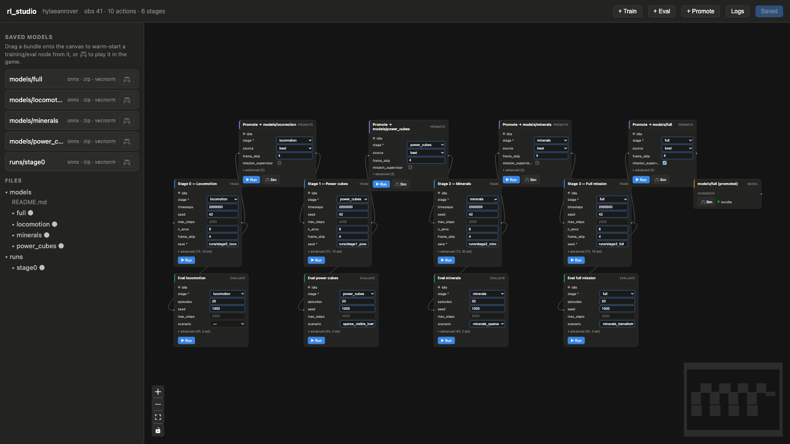

# Hylaean Rover

A Bevy game and a headless Gymnasium RL environment built on the same
simulation — a rover roams a lunar landscape, manages a battery,
collects power cubes, surveys minerals, and places survey beacons on
what it hopes are subsurface jackpots.


<video src="https://raw.githubusercontent.com/hylaeansea/hylaeansea.github.io/main/assets/images/hylaeanrover_readme.mp4" controls muted loop width="100%"></video>

## Features

- **Playable game** — Bevy 0.18 + Rapier physics, procedurally
  generated cratered terrain, full telemetry HUD (power, IMU, lidar,
  visible cubes, live reward breakdown)
- **Mineral survey gameplay** — six-element concentration maps with
  clickable terrain overlays; surface readings only hint at the
  subsurface deposits your 5 beacons actually score against
- **Headless RL environment** — the same simulation as a
  `gymnasium.Env` (PyO3, no rendering), trainable with Stable
  Baselines 3; 41-float observation, 10 discrete actions
- **Staged training curriculum** — locomotion → power_cubes →
  minerals → full, each stage warm-started from the last
  ([TRAINING_GUIDE](python/TRAINING_GUIDE.md))
- **In-game autopilot** — export a trained policy to ONNX and the game
  runs it natively via tract-onnx: toggle with **P**, hot-reload with **O**
- **rl_studio** — a web node-graph UI over the whole train → eval →
  promote → play pipeline, so you don't have to hand-assemble 80-flag
  command lines ([rl_studio/README](rl_studio/README.md))



## Quickstart

### Play the game

Requires a Rust toolchain (`rustup`). First build takes a few minutes.

```bash
cargo run -p hylaeanrover_game --release
```

**W/S** throttle · **A/D** steer · **B** drop beacon · **R** respawn
(**Shift+R** at origin) · **C** camera mode · **F1** collision wireframes.

### Set up Python (one-time, for training)

Requires Python ≥ 3.9 and a Rust toolchain.

```bash
cd python
python3 -m venv .venv && source .venv/bin/activate
pip install 'maturin[patchelf]>=1.4'
pip install -e '.[sb3]'
maturin develop --release   # rerun after any Rust change
```

### Train

Either drive the pipeline from the **rl_studio** web UI:

```bash
uv pip install --python .venv/bin/python fastapi 'uvicorn[standard]'
cd ../rl_studio && ../python/.venv/bin/python -m uvicorn server:app --port 8321
# open http://localhost:8321 and hit ▶ Run on a stage
```

or run a stage by hand (see [TRAINING_GUIDE](python/TRAINING_GUIDE.md)
for the full curriculum):

```bash
python examples/train.py --stage locomotion --timesteps 2000000 \
  --save runs/stage0_locomotion --n-envs 8 --frame-skip 4 --horizon short
```

### Run the sim with a trained model

Promoted bundles for every stage are tracked in `models/`, so this
works out of the box:

```bash
cargo run -p hylaeanrover_game --release -- --policy models/full/model.onnx
```

**P** toggles autopilot vs. manual, **O** hot-reloads the ONNX from
disk mid-run. In rl_studio, the 🎮 button on any saved model does the
same launch.

## Docs

- [python/README.md](python/README.md) — action/observation schema, env API
- [python/TRAINING_GUIDE.md](python/TRAINING_GUIDE.md) — step-by-step curriculum
- [docs/rl_training_plan.md](docs/rl_training_plan.md) — curriculum design + progress log
- [rl_studio/README.md](rl_studio/README.md) — the node-graph UI

## License

Source code: dual-licensed under MIT or Apache-2.0 (your choice).
Bundled fonts in `crates/hylaeanrover_game/assets/fonts/` are
DejaVu Sans (Bitstream Vera derivative, see `LICENSE.txt`).
